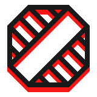

    <picture>
        <source media='(prefers-color-scheme: dark)' srcset='./.github/threshold-logo-light-160.png' />
        <source media='(prefers-color-scheme: light)' srcset='./.github/threshold-logo-dark-160.png' />
        
    </picture>

# ⬡ Threshold

Project structure and architecture linter

# ⬡ Motivation/Promise

# ⬡ Features

# ⬡ Installation

# ⬡ Usage/Utilizing/Enjoyment

# ⬡ API

# ⬡ Contribution

Feel free to open an issue/discussion with request/report, but ensure you read/follow [Contributor Covenant Code of Conduct](code_of_conduct.md)

# ⬡ Development/History

[Changelog/Past/Versions](changelog.md)

[Roadmap/Future](roadmap.md)

# ⬡ Legal info

Project licensed under [MIT License](license.md). [What it means](https://choosealicense.com/licenses/mit/)

# ⬡ Brand/Look

Project name, logo, visual design and writing style heavily inspired by [Control game](https://www.remedygames.com/games/control/) (made by [Remedy Entertainment](https://www.remedygames.com/))
